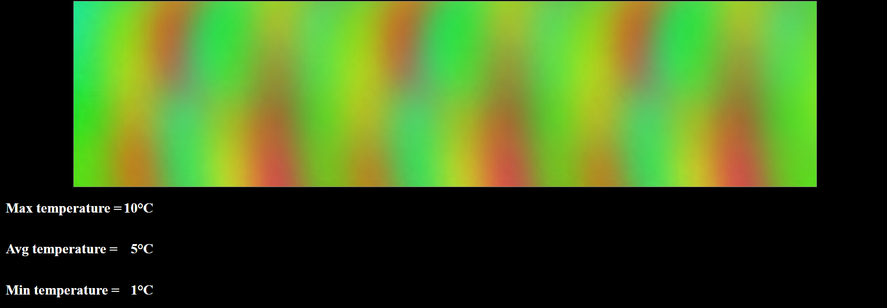

# Spring visualiser for MLX90621 16x4 thermal camera
## Interface:


## Usage:
1. Start program
2. Open http://127.0.0.1:8080/
3. Send data from thermal camera:
    
    ````
    Request type: PUT
    URL: http://127.0.0.1:8080/data
    Body example (JSON array named "temperatures" with 64 elements):
    {
        "temperatures" : 
        [1,2,3,4,5,6,7,8,9,10,1,2,3,4,5,6,7,8,9,10,1,2,3,4,5,6,7,8,9,10,1,2,3,4,5,6,7,8,9,10,1,2,3,4,5,6,7,8,9,10,1,2,3,4,5,6,7,8,9,10,1,2,3,4]
    }
    ````
    
